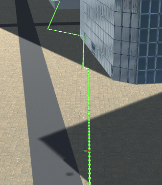
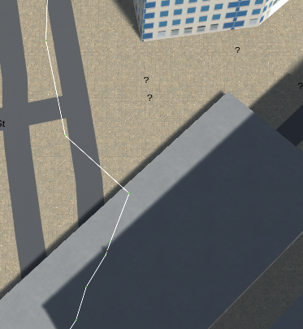
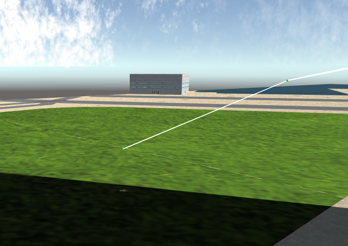
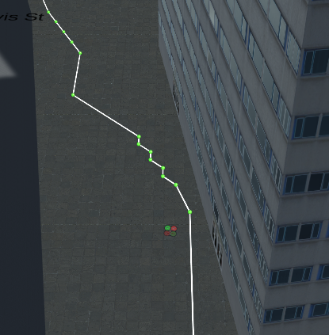
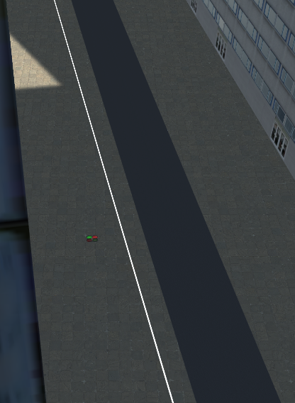
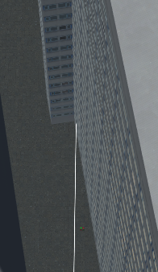
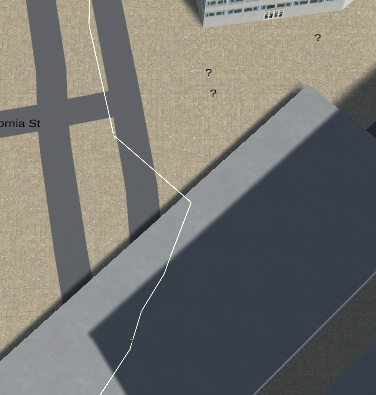
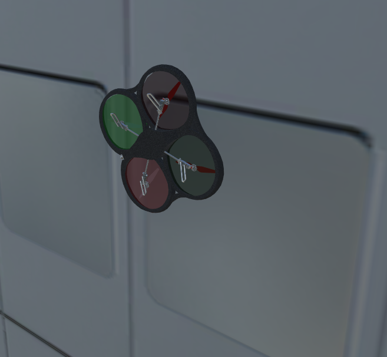

## Project: 3D Motion Planning


---

## [Rubric](https://review.udacity.com/#!/rubrics/1534/view) Points
### Here I will consider the rubric points individually and describe how I addressed each point in my implementation.

---
### Writeup / README

### Explain the Starter Code

#### 1. Explain the functionality of what's provided in `motion_planning.py` and `planning_utils.py`
These scripts contain a basic planning implementation that includes,
a basic solution for the path planing problem using a complete grid
approach. Additionally a graph is also computed with using the Voronoi
approach. This graph is feed to the A* algorithm

### Implementing The Path Planning Algorithm

#### 1. Set the drone's global home position (Done)
The home's longitude and latitude are extracted from the csv file using
several string manipulation methods in lines 236-238. In line 240 the
self.set_home_position method is used to... to set the home position.

#### 2. Set your current local position (Done)
In order to define a "local position" we need to define a home position in the map, so we can have our local position relative to our home position. This is achieved in line 242 where the function global_to_local is used to convert the global position to local, north east and down coordinates.

#### 3. Set grid start position from local position (Done)
Line `253` in `motion_planning.py`.
#### 4. Set grid goal position from geodetic coords (Done)
Line `256` `motion_planning.py`.

#### 5. Modify A* to include diagonal motion (or replace A* altogether)

##### 1. Solution
First the a basic solution of the project is implemented. The grid, the heuristic, the start and the goal are given to the a_star algorithm.
To do this the Action class is modified as suggested, adding the diagonal
motions NORTHWEST-SOUTHEAST. To handle possible errors when removing actions,
try/except clauses are addded to the valid_actions method. The result generated
is shown in the image below. With this solution the total number of waypoints is
436. As mentioned in the lectures this is very inefficient since we are visiting
every single point on the grid on the way to our goal.



With the basic solution we get 452 points to the given goal. But this is optimized in
the cull/pruning section.

Interesting to note: the grid base method take a very long time to finish
when the drone is trying to look for a route in open space.


##### 2. Solution

The second implemented solution uses the graph approach. The `create_voronoi_edges(grid, points)`, in `planning_utils.py` is implemented on line `136`. This approach is applied from line `273` to `295`. It is useful to cache the graph for faster computation.Since this is a static map we can do this. If we had a continously moving map we would have to try another approach. After the edges are calculated, they are added to the `nx_graph` object. Then the closest points from the Voronoi graph to the given start and goal are given. From what I have seen these points are usually close enough but one could also add the points to the path to make it exact.



##### 3. Solution
The third implemented solution uses the probabilistic roadmap approach. This approach
is implemented between lines `292` and `314`. Points are randomly scattered thouughout the map avoiding to have points that overlap with polygons. This is done with the provided `Sample` class. The start and goal points are added to the nodes list
and the the function `create_probabilistic_graph` is run with the nodes, connections,
and polygons as arguments. This function takes a very long time (~thousands of seconds)
and really needs to be optmized. In order to have a faster execution time, the graph is
cached. The path is very quick and efficient going above buildings without issues.



npoints 11

#### 6. Cull waypoints (Done)

##### 1. Pruning for basic/grid only solution
As a basic pruning I first use a collinearity test. Implemented
in the function `prune_path` and applied to the obtained waypoints in line `274`.



Npoints= 52

Bresenham is also implemented and applied and in (line `68` and `275` respectively ) this results only in 9 points, but usually fails. It may be that the map coordinates are not completely correct,
but this need to be further investigated.



9 points.

##### 2. Pruning for Voronoi solution




8 points




35 points

#### 7. Table Summary (Done)


Index | Approach | Npts | Works? | Comments
--- | --- | --- | --- | ---
1 | A* + grid | 452 | Yes | Too many points
2 | A* + grid + coll | 52 | Yes | Works well
3 | A* + grid + bres | 5 | No | Crashes in corner of building
4 | Voronoi, A* graph | 48 | yes  | --
5 | Voronoi, A* graph collinear  | 35 | yes | --
6 | Voronoi, A* graph bres | 4 | yes | works very well
7 | Polygon 3D, A* graph | 9  | yes | graph takes thousands seconds to build!


### Execute the flight
#### 1. Does it work?
It works!


#### Issues


```python
Traceback (most recent call last):
  File "/home/david/miniconda3/envs/fcnd/lib/python3.6/site-packages/udacidrone/connection/connection.py", line 88, in notify_message_listeners
    fn(name, msg)
  File "/home/david/miniconda3/envs/fcnd/lib/python3.6/site-packages/udacidrone/drone.py", line 119, in on_message_receive
    if (((msg.time - self._message_time) > 0.0)):
AttributeError: 'int' object has no attribute 'time'
```

A common occurence :D:
